# Task 1: Multi-Agent Architecture Research & System Design

## 1. Architectural Pattern Comparative Analysis

In clinical multi-agent systems, system failures are not merely bugs—they can directly result in medical harm, delayed emergency care, or drug interactions. Selecting the appropriate architectural topology is the single most critical structural decision.

| Dimension | Supervisor Pattern | Swarm Pattern (Peer-to-Peer) | Hierarchical Sub-Team Pattern |
| :--- | :--- | :--- | :--- |
| **Topology** | Central orchestrator directs specialized worker agents; workers report back to supervisor. | Decentralized; agents execute autonomous handoffs to peers via dynamic tool calls. | Tree structure: A Master Supervisor orchestrates Sub-Supervisors (e.g., Clinical Lead, Admin Lead), each managing workers. |
| **Control Flow** | Deterministic, centralized state evaluation, single point of routing decisions. | Non-deterministic, emergent routing, peer-driven hops. | Semi-deterministic, scoped within functional domains. |
| **Auditability & Traceability** | **Extremely High**: Every state mutation and routing decision flows through the central node. | **Low**: Difficult to guarantee routing paths; risk of circular handoff loops. | **High**: Scoped traces per department, but higher call-graph depth. |
| **Latency Overhead** | Moderate: 1 router LLM call + 1 worker LLM call per step. | Variable: Can take multiple hops before reaching the correct handler. | Higher: Multi-tiered routing LLM invocations. |
| **Medical Safety Fit** | **Optimal for Outpatient Clinics**: Guarantees safety guardrails, triage verification, and supervisor gatekeeping. | **Dangerous in Healthcare**: Uncontrolled peer handoffs make deterministic red-flag halts difficult to enforce. | **Overkill for 8 agents**: Adds unnecessary latency and complexity for a single clinic network. |

### Chosen Pattern: Supervisor Pattern with LangGraph StateGraph
For City Care Clinics, we adopt the **Supervisor Pattern implemented via LangGraph StateGraph**.
- **Centralized Safety Enforcement**: Every patient utterance is evaluated by the Supervisor and immediately intercepted by the Triage Agent if emergency triggers exist.
- **Predictable State Transitions**: LangGraph conditional edges guarantee that workers cannot bypass mandatory steps (e.g., Scheduling Agent cannot book an appointment until Intake and Triage state nodes have completed).
- **Human-in-the-Loop (HITL) Interruption Points**: The central state machine allows deterministic halts (using LangGraph `interrupt_before` / `interrupt_after`) for Doctor reviews.

---

## 2. When to Use One Agent vs. Many Agents

A common architectural antipattern is over-engineering a system into dozens of micro-agents when a single well-prompted agent would suffice. Conversely, overloading a single agent with all clinical duties creates prompt bloat, tool confusion, and severe safety hazards.

```
┌────────────────────────────────────────────────────────────────────────┐
│                   Decision Framework: 1 Agent vs Many Agents          │
├───────────────────────────────────┬────────────────────────────────────┤
│         Single Agent              │          Multi-Agent Team          │
├───────────────────────────────────┼────────────────────────────────────┤
│ • Small, unified toolset (< 4 tools)│ • Distinct cognitive domains       │
│ • Homogeneous task context        │   (Intake vs Drug Chemistry vs     │
│ • No strict privilege separation  │   Scheduling logistics)            │
│ • Low risk of tool hallucination  │ • High tool count (> 10 tools)     │
│ • Single conversational persona    │ • Strict security boundaries (RBAC)│
│                                   │ • Independent evaluation & testing │
│                                   │ • HITL approval required on subsets│
└───────────────────────────────────┴────────────────────────────────────┘
```

### Why Multi-Agent is Required for City Care Clinics
1. **Tool Namespace Isolation**: The Scheduling Agent needs Google Calendar/Supabase slot booking tools. The Prescription Safety Agent needs DrugBank/openFDA chemical interaction tools. Combining them in one prompt causes tool retrieval confusion and hallucinations.
2. **Safety & Negative Prompting**: The Intake Agent must be warm, conversational, and inquisitive in UrduLish. The Prescription Safety Agent must be strictly analytical, mathematical (dose calculations), and conservative. Separating them prevents persona bleed.
3. **Privilege & PII Boundaries**: The Records Agent touches sensitive historical health records (requiring audit logging), while the Scheduling Agent only needs doctor availability and patient contact identifiers.
4. **Deterministic Unit Testing**: Each agent can be evaluated independently with DeepEval/Ragas against domain-specific test suites (e.g., testing Triage red-flag recall independent of booking logic).

---

## 3. Shared State vs. Message Passing

Multi-agent coordination can be implemented through **Pure Message Passing** (actors exchanging message strings) or a **Unified Shared State** (a centralized state container updated via reducers).

```
Shared State (LangGraph Pattern):
  [Patient Input] ──► State Container (ClinicalState) ──► Agent Updates Reducers ──► Output
                           ▲                     │
                           │                     ▼
                       Supervisor           Sub-Agents
```

### Why Shared State (LangGraph TypedDict) is Superior for Clinical Workflows:
1. **Accumulated Clinical Picture**: Clinical intake requires gradual collection of data:
   - Chief Complaint
   - Duration
   - Associated Symptoms
   - Allergy History
   - Current Medications
   - Triage Category
   With a shared `ClinicalState`, each agent enriches the central context without requiring massive message history re-parsing.
2. **Zero Loss of Critical Metadata**: In pure message passing, critical flags (e.g., `allergy_penicillin = true`, `triage_level = "EMERGENCY"`) can get buried deep in conversational chat turns and dropped by LLM context truncation. In shared state, these attributes persist as structured fields throughout the session.
3. **Type Safety & Validation**: Pydantic / TypedDict enforcement ensures that downstream agents (like Clinical Summary Agent) receive strictly validated data types.

---

## 4. Model Context Protocol (MCP): Architecture & Clinical Significance

The **Model Context Protocol (MCP)**, open-sourced by Anthropic, is an open standard that decouples tool and data execution from LLM client implementations.

```
┌───────────────────────┐            MCP Protocol            ┌──────────────────────┐
│  LangGraph Multi-Agent│ ◄────────────────────────────────► │   MCP Server Layer   │
│       Client          │        JSON-RPC 2.0 (Stdio / SSE)  │                      │
└───────────────────────┘                                    └──────────┬───────────┘
                                                                        │
                    ┌─────────────────────────┬─────────────────────────┼─────────────────────────┐
                    ▼                         ▼                         ▼                         ▼
          ┌──────────────────┐      ┌──────────────────┐      ┌──────────────────┐      ┌──────────────────┐
          │  Supabase FHIR   │      │   Prescription   │      │ Google Calendar  │      │  Vision/OCR Lab  │
          │  Database Server │      │ Safety DB Server │      │ Scheduling Server│      │  Parser Server   │
          └──────────────────┘      └──────────────────┘      └──────────────────┘      └──────────────────┘
```

### Why MCP Matters for City Care Clinics:
- **Security Isolation & Defense in Depth**: The LLM never has raw database connection strings or direct file-system access. MCP servers run in isolated processes with scoped credentials.
- **Standardized Clinical Tool Contracts**: Exposes clinical operations (e.g., `check_drug_clash`, `book_slot`, `fetch_patient_fhir_record`) over clean JSON-RPC contracts.
- **Audit Logging at the Tool Layer**: Every tool invocation passing through an MCP server can be intercepted, timestamped, and written to an immutable HIPAA/GDPR-compliant audit log before execution.
- **Provider Agnostic**: If City Care Clinics switches underlying models between GPT-4o, Claude 3.5 Sonnet, and Gemini 1.5 Pro, the MCP tool servers remain completely untouched.

---

## 5. Human-in-the-Loop (HITL) Patterns in Clinical AI

Autonomous AI must never write unreviewed medical instructions or prescriptions to a patient. We enforce three standard HITL patterns:

```
1. Interrupt Pattern:
   [Agent Generates Output] ──► [System Interrupted] ──► [Doctor Review Modal] ──► [Approved: Send to Patient]

2. Approve Pattern:
   Prescription Safety check flags clashing drugs ──► Physician reviews override warning ──► Authorizes or cancels.

3. Edit Pattern:
   Clinical Summary Agent compiles SOAP Note ──► Physician edits Assessment & Plan ──► Commits to Supabase FHIR.
```

1. **Interrupt (`interrupt_before` / `interrupt_after`)**:
   - The LangGraph engine halts execution when a node of type `human_review_gate` is reached.
   - The thread state is saved to the Supabase checkpointer.
   - Execution only resumes when an authenticated physician submits a signed payload.
2. **Approve**:
   - Used for triage overrides and post-consultation prescription dispatches.
   - A single-click approval if the doctor agrees with the system's generated draft.
3. **Edit (Collaborative Co-Pilot)**:
   - The doctor can modify dosage, adjust the SOAP note, or edit patient instructions in the UI prior to authorizing dispatch.
   - The agent incorporates the physician's edits back into the persistent record.

---

## 6. Full System Architecture Diagram

```mermaid
graph TD
    User([Patient / Doctor on Chat UI]) <--> UI[FastAPI Chat Endpoint + Streamlit/Next.js]
    UI <--> Presidio[Microsoft Presidio PII Masking / Anonymizer]
    Presidio <--> SupCheck[Supabase State Checkpointer]
    
    subgraph MultiAgentEngine [LangGraph Multi-Agent Clinical Engine]
        Supervisor[Supervisor / Router Agent]
        
        Intake[1. Intake Agent\n• UrduLish Chat\n• Symptom Gathering]
        Triage[2. Triage Agent\n• Urgency Classification\n• 1122 Escalation]
        Scheduling[3. Scheduling Agent\n• 5 Clinics & 30 Doctors\n• Slot Management]
        Records[4. Records Agent\n• Past Encounters\n• Lab Reports Retrieval]
        Summary[5. Clinical Summary Agent\n• SOAP Note Generation\n• Pre-visit Briefing]
        Safety[6. Prescription Safety Agent\n• Drug Interaction Check\n• Dose Limits & Allergies]
        FollowUp[7. Follow-up Agent\n• Medicine Adherence\n• Recovery Check-ins]
        
        HITLGate{Human-in-the-Loop Gate\nDoctor Approval Required?}
    end
    
    subgraph MCPLayer [Model Context Protocol Server Infrastructure]
        MCPSupa[MCP Supabase FHIR Server\n• Patients, Encounters, Obs]
        MCPDrug[MCP Drug Knowledge Server\n• 100+ Pakistani Medicines\n• Contraindications]
        MCPSched[MCP Scheduling Server\n• Slot Finder & Booking]
        MCPLab[MCP Lab Vision/OCR Server\n• CBC, LFT, Lipid, HbA1c]
    end
    
    subgraph Persistence [Data & Knowledge Stores]
        DB[(Supabase PostgreSQL\nFHIR-aligned Tables + RLS)]
        Vec[(pgvector / Vector Knowledge\nClinic FAQs & Triage Guides)]
        Audit[(Immutable Audit Logs)]
    end

    Supervisor -->|Directs Task| Intake
    Supervisor -->|Evaluates Severity| Triage
    Supervisor -->|Books / Reschedules| Scheduling
    Supervisor -->|Queries History| Records
    Supervisor -->|Compiles Chart| Summary
    Supervisor -->|Checks Script| Safety
    Supervisor -->|Post-Visit Care| FollowUp

    Intake --> Supervisor
    Triage -->|RED FLAG: Emergency| EmergencyEscalate[Instant 1122 Escalation Protocol]
    Triage -->|Routine / Urgent| Supervisor
    Scheduling --> Supervisor
    Records --> Supervisor
    Summary --> HITLGate
    Safety --> HITLGate
    FollowUp --> Supervisor

    HITLGate -->|Requires Review| DoctorReview([Attending Physician Review UI])
    DoctorReview -->|Approved / Edited| Supervisor

    Intake -.-> MCPSupa
    Scheduling -.-> MCPSched
    Records -.-> MCPSupa
    Records -.-> MCPLab
    Safety -.-> MCPDrug
    Summary -.-> MCPSupa
    FollowUp -.-> MCPSupa

    MCPSupa --> DB
    MCPSched --> DB
    MCPDrug --> Vec
    MCPLab --> DB
    Presidio -.-> Audit
    HITLGate -.-> Audit
```



---

## 7. State Schema Design (LangGraph TypedDict)

```python
from typing import TypedDict, List, Dict, Optional, Any, Literal

class SymptomEntry(TypedDict):
    name: str
    duration: str
    severity: Literal["mild", "moderate", "severe"]
    location: Optional[str]
    onset: Optional[str]

class ClinicalState(TypedDict):
    session_id: str
    patient_id: Optional[str]
    anonymized_user_input: str
    raw_user_input_hash: str
    language_preference: Literal["urdu_lish", "english", "urdu"]
    
    # Clinical Intake
    chief_complaint: Optional[str]
    symptoms: List[SymptomEntry]
    known_allergies: List[str]
    current_medications: List[str]
    
    # Triage State
    triage_level: Optional[Literal["EMERGENCY", "URGENT", "ROUTINE"]]
    red_flags_identified: List[str]
    emergency_escalated: bool
    
    # Scheduling State
    target_specialty: Optional[str]
    target_branch: Optional[str]
    target_doctor_id: Optional[str]
    appointment_slot: Optional[str]
    booking_status: Optional[str]
    
    # Clinical Documentation
    soap_note: Optional[Dict[str, str]] # S, O, A, P
    prescription_review: Optional[Dict[str, Any]]
    
    # Human Approval
    requires_doctor_approval: bool
    doctor_approved: bool
    doctor_notes: Optional[str]
    
    # Flow Routing
    next_agent: str
    messages: List[Dict[str, str]]
```
