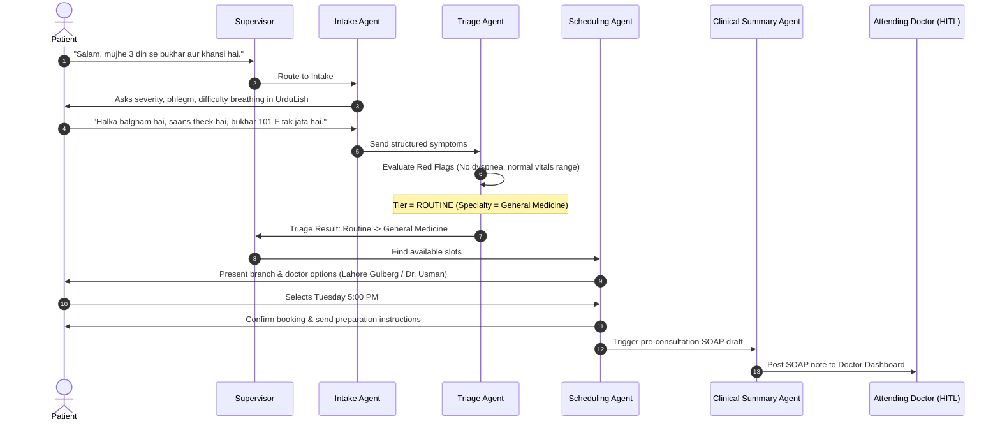
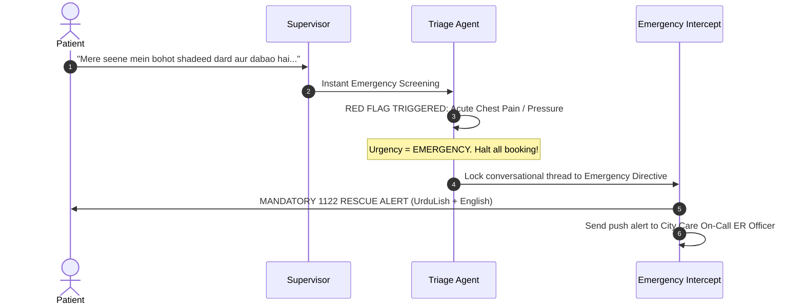
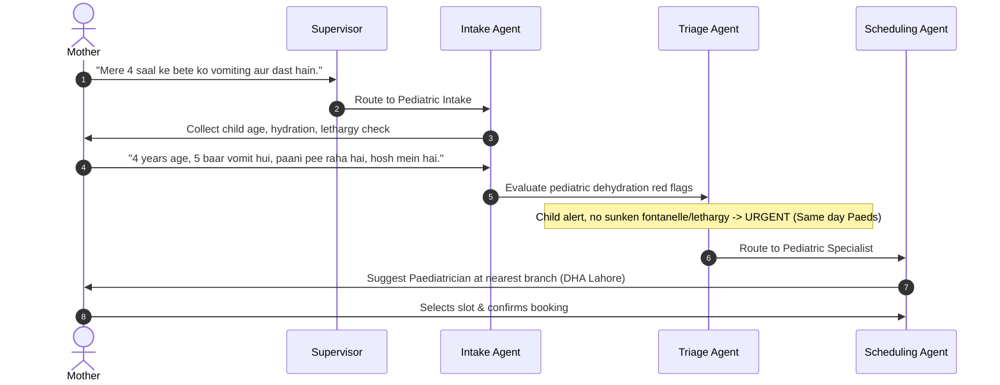
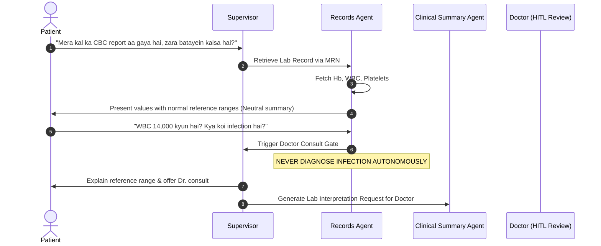
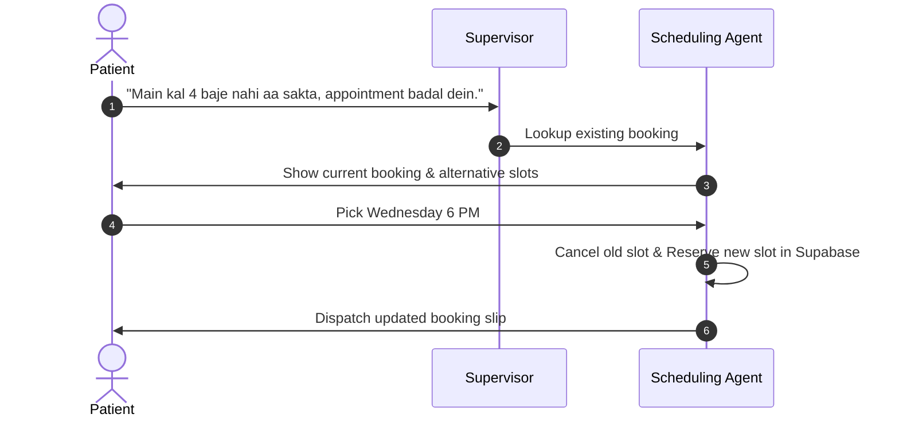
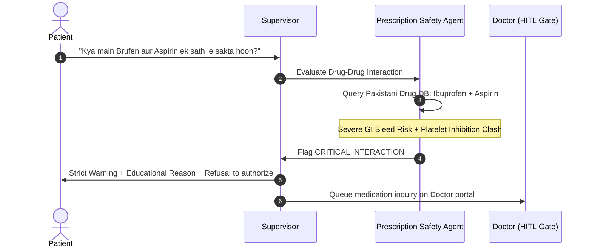
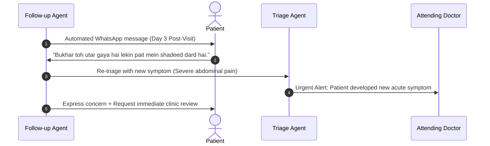

# Task 3: Patient Conversation Flows

This document details the conversational design, state transitions, and step-by-step UrduLish dialogues for the seven key patient journeys at City Care Clinics.

---

## Flow 1: New Patient with Fever and Cough (Routine / General Medicine)

### Mermaid Workflow

### Turn-by-Turn Dialogue (UrduLish)
* **Patient:** *"Assalam o Alaikum, mujhe pichle 3 din se tez bukhar aur khansi hai. Doctor ko dikhana hai."*
* **Intake Agent:** *"Wa Alaikum Assalam! City Care Clinics mein khushamdeed. Main aap ki madad karta hoon. Yeh batayein ke bukhar kitna record kiya hai, aur kya saans lene mein koi takleef ya seene mein dard mehsoos ho raha hai?"*
* **Patient:** *"Bukhar taqreeban 101 F hai. Saans lene mein koi takleef nahi hai, bas gala kharab hai aur halka balgham hai."*
* **Intake Agent:** *"Shukriya tafseel batane ka. Kya aap pehle se koi dawa le rahe hain ya kisi dawa se koi allergy hai?"*
* **Patient:** *"Sirf Panadol li hai bukhar ke liye. Koi allergy nahi hai."*
* **Triage Agent (Internal):** Evaluates red-flags. Dyspnea absent, vitals stable, duration 3 days. **Classification: ROUTINE. Recommended Specialty: General Medicine.**
* **Scheduling Agent:** *"Theek hai. Aap ki alamaat ke mutabiq General Physician se check-up munasib rahega. Hamare paas Dr. Usman Tariq (MBBS, FCPS - General Medicine) City Care Gulberg Branch mein dastyab hain:*
  *1) Aaj shaam 6:00 PM*
  *2) Kal subah 11:30 AM*
  *Konsa waqt aap ke liye behtar hoga?"*
* **Patient:** *"Aaj shaam 6:00 PM theek hai."*
* **Scheduling Agent:** *"Aap ki appointment Dr. Usman Tariq ke saath aaj shaam 6:00 PM Gulberg branch mein confirm ho chuki hai (Booking ID: #CC-8421). Bara-e-meharbani waqt se 10 minute pehle tashreef layein. Allah aap ko sehat de!"*

---

## Flow 2: Patient with Chest Pain (Emergency Escalation Path)

### Mermaid Workflow

### Turn-by-Turn Dialogue (UrduLish)
* **Patient:** *"Salam, mere seene mein achanak bohot shadeed dard aur dabao shuru ho gaya hai, bayen baazu (left arm) mein bhi dard ja raha hai aur paseenay aa rahe hain..."*
* **Supervisor / Triage Agent (Instant Intercept):**
* **Triage Agent:**
  > 🚨 **EMERGENCY MEDICAL ALERT / FORI IMDAD**
  >
  > *"Aap ki batai hui alamaat (seene mein shadeed dard, baazu mein phailao, paseenay) nihayat sanjeeda aur EMERGENCY hain. Yeh heart attack ki alamat ho sakti hai.*
  >
  > 🛑 **Foran yeh iqdamat karein:**
  > 1. **Bila-takhir 1122 par call karein** ya qareebi hospital ke Emergency Room (ER) pohanchein.
  > 2. Khud drive mat karein, kisi ko gaari chalane ya sath chalne ka kahein.
  > 3. Seedha laitne ke bajaye aaramdeh posht laga kar baith jayein.
  >
  > ⚠️ *Hamari online appointment ka intizar hargiz na karein. Baraye meharbani foran 1122 rescue call milayein!"*
* **Patient:** *"Kya main koi Panadol ya Disprin le loon?"*
* **Triage Agent:** *"AI assistant dawai tajweez karne ka majaz nahi hai. Agar aap ko pehle doctor ne aisi soorat mein Disprin batayi ho toh alag baat hai, lekin is waqt sab se ahem qadam foran 1122 call karna ya Emergency ward pohanchana hai. Foran madad mangiye!"*

---

## Flow 3: Mother Booking for a Child (Pediatrics)

### Mermaid Workflow

### Turn-by-Turn Dialogue (UrduLish)
* **Mother:** *"Assalam o Alaikum, mere 4 saal ke bete Ahmed ko subah se ultiyan aur dast (vomiting & diarrhea) lagay hue hain. Bohot kamzor lag raha hai."*
* **Intake Agent:** *"Wa Alaikum Assalam. Hum samajh sakte hain aap pareshan hongi. Yeh batayein ke bachay ne aakhri dafa peshab (urine) kab kiya tha, aur kya bacha paani ya ORS pee raha hai ya bilkul bhi roak nahi pa raha?"*
* **Mother:** *"Subah 2 ghante pehle peshab kiya tha, ORS thora thora ghunt karke pee raha hai, ulti abhi thori ruki hai lekin thaka hua hai."*
* **Triage Agent (Internal):** Evaluates pediatric status. Age 4 years, not in hypovolemic shock, retaining small sips. **Tier: URGENT (Same Day Consultation with Child Specialist).**
* **Scheduling Agent:** *"Shukriya. Chotay bachon mein paani ki kami (dehydration) jaldi ho sakti hai, is liye aaj hi Paediatrician (Bachon ke doctor) ko dikhana zaroori hai.*
  *City Care DHA Branch mein hamari Paediatrician Dr. Ayesha Malik aaj dopehar 2:30 PM par dastyab hain.*
  *Kya yeh waqt aap ke liye theek hai?"*
* **Mother:** *"Jee bilkul theek hai, please book kar dein."*
* **Scheduling Agent:** *"Ahmed ke liye appointment Dr. Ayesha Malik ke paas aaj 2:30 PM confirm kar di gayi hai (ID: #PED-3091). Clinic aate hue raste mein bache ko chamach se thora thora ORS dete rahein. Agar bacha behosh ho ya peshab 6 ghante tak na kare toh foran Emergency jayein."*

---

## Flow 4: Returning Patient Asking About a Lab Report

### Mermaid Workflow

### Turn-by-Turn Dialogue (UrduLish)
* **Patient:** *"Salam, mera kal City Care lab se CBC ka test hua tha (MRN-90214). Kya aap report dekh kar bata sakte hain ke sab theek hai?"*
* **Records Agent:** *"Wa Alaikum Assalam! Main aap ki report check karta hoon...*
  *Aap ki CBC report (Dated: Kal Shaam) ke nataij yeh hain:*
  *• Haemoglobin (Hb): 13.5 g/dL (Normal Range: 13.0 - 17.0) — Normal*
  *• Platelets: 240,000 /mcL (Normal Range: 150,000 - 450,000) — Normal*
  *• Total Leukocyte Count (WBC): 14,200 /mcL (Normal Range: 4,000 - 11,000) — High"*
* **Patient:** *"WBC 14,200 itna zyada kyun hai? Kya mujhe koi khatarnak infection ya bemari ho gayi hai?"*
* **Records Agent (Safety Guardrail Active):**
  *"Main samajh sakta hoon ke high value dekh kar pareshani hoti hai, lekin aik AI assistant hone ke nate main bimari ki tashkhees (diagnosis) nahi kar sakta. WBC count mein izafa kisi aam gale ki kharash ya jismani stress se bhi ho sakta hai.*
  *Aap ke muallij (doctor) Dr. Tariq aap ki mukammal physical condition dekh kar hi sahi waja bata sakte hain. Kya main aap ke doctor se is report par 10 minute ka tele-consult ya clinic follow-up schedule kar doon?"*
* **Patient:** *"Haan theek hai, follow-up schedule kar dein."*

---

## Flow 5: Reschedule / Cancel Appointment

### Mermaid Workflow

### Turn-by-Turn Dialogue (UrduLish)
* **Patient:** *"Salam, meri kal mangal ko 4 baje Dr. Nabila (Gynaecology) ke sath appointment hai. Kisi majboori ki waja se main kal nahi aa sakti, kya yeh badal sakti hai?"*
* **Scheduling Agent:** *"Wa Alaikum Assalam. Jee bilkul, main aap ki booking check kar rahi hoon. Aap ki appointment Dr. Nabila Rehman ke sath kal 4:00 PM City Care Islamabad (F-8 Branch) mein booked hai.*
  *Dr. Nabila ke paas aane wale dino mein yeh auqaat dastyab hain:*
  *1) Budh (Wednesday) shaam 5:30 PM*
  *2) Jumerat (Thursday) dopahar 12:00 PM*
  *Aap ke liye konsa waqt munasib rahega?"*
* **Patient:** *"Budh (Wednesday) shaam 5:30 PM best hai."*
* **Scheduling Agent:** *"Aap ki appointment kamyabi se reschedule kar di gayi hai:*
  *• Doctor: Dr. Nabila Rehman (Gynaecologist)*
  *• Naya Waqt: Budh (Wednesday), Shaam 5:30 PM*
  *• Branch: City Care F-8, Islamabad*
  *• New Booking ID: #RES-5512*
  *Aap ki purani mangal wali booking cancel kar di gayi hai. Shukriya!"*

---

## Flow 6: Patient Asking "Kya main yeh dawai le sakta hoon?" (Medication Safety)

### Mermaid Workflow

### Turn-by-Turn Dialogue (UrduLish)
* **Patient:** *"Salam, mere sir mein bohot dard ho raha hai aur kamar mein bhi. Main pehle se Dil ki dawai Aspirin (Loprin 75mg) leta hoon. Kya main sath mein Brufen 400mg kha sakta hoon?"*
* **Prescription Safety Agent (Safety Intercept):**
  > ⚠️ **MEDICATION SAFETY WARNING / DAWAYI KI EHTIYAT**
  >
  > *"Nahi! Baraye meharbani Brufen (Ibuprofen) aur Loprin/Aspirin ko aik sath hargiz mat khayein.*
  >
  > **Waja (Clinical Reason):**
  > Yeh dono dawaayein mil kar maiday (stomach) mein shadeed jalan, ulcer aur khoon ke behne (bleeding risk) ko bohot barha deti hain, aur dil ke liye Aspirin ke asar ko bhi mutasir karti hain.
  >
  > 🛑 **Hidayat:**
  > AI assistant aap ko mutabadil (alternative) dawai shuru karne ki ijazat nahi de sakta. Dard ke liye aam tor par sadah Panadol (Paracetamol) istemal ki jati hai agar aap ko jigar (liver) ka masla na ho, lekin aap ko chahiye ke apne doctor se mashwara karein.*
* **Patient:** *"Acha shukriya, main Panadol le leta hoon aur doctor se check karwata hoon."*

---

## Flow 7: Follow-up After a Visit (Adherence & Recovery Check)

### Mermaid Workflow

### Turn-by-Turn Dialogue (UrduLish)
* **Follow-up Agent (Automated Outreach - Day 3):**
  *"Assalam o Alaikum Janab Tariq Sahab, umeed hai aap khariyat se honge. Yeh City Care Clinics ki taraf se follow-up message hai. 3 din pehle aap Dr. Usman ke paas check-up ke liye tashreef laye thay.*
  *1) Kya aap ne tajweez karda course (Augmentin) baqaidgi se mukammal kiya?*
  *2) Ab aap ki tabiyat kaisi hai aur bukhar kaisa hai?"*
* **Patient:** *"Walaikum Assalam. Bukhar toh bilkul theek ho gaya hai, lekin kal raat se pait ke nichlay hissay mein shadeed dard shuru ho gaya hai aur chakkar aa rahe hain."*
* **Follow-up Agent & Triage Agent (Re-Triage Trigger):**
  *"Yeh jaan kar afsos hua ke aap ko pait mein shadeed dard mehsoos ho raha hai. Chunke bukhar theek hone ke baad yeh aik nayi aur shadeed alamat (acute pain) samne aayi hai, is ko nazar-andaz nahi kiya ja sakta.*
  *Main ne foran Dr. Usman Tariq ko aap ki tabiyat ke bare mein alert bhej diya hai.*
  *Baraye meharbani aaj hi clinic mein check karwayein, ya agar dard bardasht se bahar ho ya behoshi mehsoos ho toh foran Emergency jayein. Kya main Dr. Usman ke sath aaj dopehar ka urgent review slot reserve kar doon?"*
* **Patient:** *"Jee meharbani hogi, jaldi slot book kar dein."*
