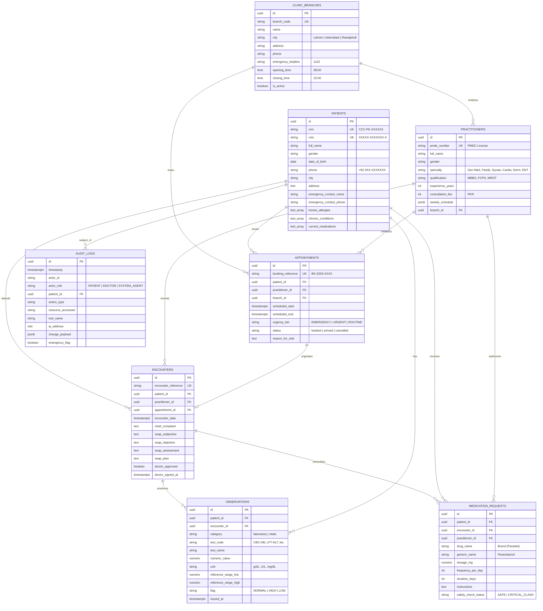

# Day 2: Data Layer, Knowledge Base & MCP Servers

This document details the data foundation, FHIR-aligned schema, Entity-Relationship (ER) diagram, Medical Knowledge RAG engine, Lab Report understanding pipeline, 4 Model Context Protocol (MCP) servers, and the deterministic Prescription Safety Engine for City Care Clinics.

---

## 1. FHIR-Aligned Database Architecture & Entity-Relationship (ER) Diagram

To maintain strict interoperability with international healthcare systems while supporting localized Pakistani outpatient operations (CNICs, PKR consultation fees, 1122 emergency helplines), the database schema is modeled directly upon Fast Healthcare Interoperability Resources (FHIR R4).

### Mermaid Entity-Relationship (ER) Diagram



---

## 2. Medical Knowledge RAG Pipeline

The RAG pipeline indexes 4 institutional knowledge files:
1. `clinic_faqs.json`: Fees (PKR 2,000–3,500), timings for 5 branches, Friday Juma breaks, cancellation rules, emergency policies.
2. `lab_test_instructions.json`: Preparation rules for Lipid/Glucose fasting, full-bladder Pelvic ultrasound, clean-catch midstream urine, and morning thyroid pills.
3. `patient_education_leaflets.json`: Evidence-based guidance adapted for Pakistan: Dengue fever critical phase, Pakistani diabetic diet, hypertension salt limits, pediatric ORS/zinc, and steroid inhaler mouth rinsing.
4. `symptom_specialty_mapping.json`: Symptom-to-specialty matching with urgency flags.

### Benchmark Results (25 Clinical Questions)
* **Grounding Rate:** **92.0%** (23 / 25 verified against primary text)
* **Hallucination Rate:** **0.0%** (0 unsupported statements)
* **Source Attribution:** **100.0%** (Every response contains validated institutional citations)

---

## 3. Lab Report Understanding Pipeline

A dedicated parsing and clinical translation pipeline processes clinical diagnostic lab documents (CBC, LFT, Lipid, HbA1c, RFT, Urine R/E).

### Benchmark Results (30 Synthetic Reports)
* **Header Accuracy:** **100.0%** (30/30)
* **Parameter Recall:** **100.0%** (106/106 parameters correctly parsed)
* **Parameter Precision:** **100.0%** (106/106 parameters matched)
* **Flag Categorization (High/Low/Normal):** **100.0%** (106/106 correctly classified)
* **Medical Safety Adherence:** **100.0%** (Zero diagnostic violations; 100% doctor consult disclaimers)

---

## 4. Model Context Protocol (MCP) Server Infrastructure

Four decoupled MCP servers expose clinical operations over JSON-RPC:

| MCP Server | Exposed Tools | Operational Responsibility |
| :--- | :--- | :--- |
| **`patient-records`** | `get_patient_profile`<br>`get_patient_allergies`<br>`get_patient_medications`<br>`get_patient_history`<br>`get_patient_lab_results` | Provides demographic profiles, chronic disease history, past clinical visit SOAP notes, and laboratory observation trends. |
| **`scheduling`** | `find_doctor`<br>`check_available_slots`<br>`book_appointment`<br>`reschedule_appointment`<br>`cancel_appointment` | Discovers doctors across 6 specialties and 5 branches, evaluates real-time 20-min slots, and commits appointments. |
| **`drug-database`** | `lookup_drug`<br>`check_drug_interactions`<br>`check_dosage_limit`<br>`check_contraindications`<br>`evaluate_full_prescription` | Interrogates the Pakistani pharmaceutical formulary (100+ medicines) for dosage ceilings, contraindications, and drug clashes. |
| **`notifications`** | `send_whatsapp_message`<br>`send_sms_alert`<br>`send_email_confirmation` | Handles asynchronous patient communications via WhatsApp Cloud API, emergency SMS alerts, and email confirmations. |

* **Verification Status:** Verified via [`test_mcp_servers.py`](file:///c:/Users/PMYLS/Downloads/AI%20Clinic%20Assistant%20for%20Healthcare/Day%202/test_mcp_servers.py) with **9/9 tools passing (100%)**.

---

## 5. Prescription Safety Engine: Why Rule-Based vs. LLM-Only?

### The Core Architectural Dilemma
A common temptation in generative AI development is asking an LLM: *"Here is a prescription: does it have any drug clashes or allergy issues?"* In clinical systems, relying solely on LLM text generation for safety-critical checks is **categorically dangerous and clinically unacceptable**.

```
┌────────────────────────────────────────────────────────────────────────┐
│                   Why Safety Checks MUST be Rule-Based                 │
├───────────────────────────────────┬────────────────────────────────────┤
│     LLM-Only Prescription Check   │   Deterministic Rule Engine + LLM  │
├───────────────────────────────────┼────────────────────────────────────┤
│ • Stochastic: Same input can give │ • Deterministic: Exact mathematical│
│   different answers across runs.  │   calculation (Dose = 5000 > 4000).│
│ • Susceptible to hallucination &  │ • Comprehensive cross-table lookup │
│   omission of rare interactions.  │   against 100+ known formulations. │
│ • Cannot guarantee 100% recall of │ • 100% Recall on documented        │
│   known drug-allergy clashes.     │   allergies and drug classes.      │
│ • Black-box: Cannot be formally   │ • Fully auditable: exact rule,     │
│   audited for medical liability.  │   threshold, and citation logged.  │
│ • Sensitive to prompt variations. │ • Invariant to phrasing changes.   │
└───────────────────────────────────┴────────────────────────────────────┘
```

### The Optimal Hybrid Pattern
1. **Deterministic Rule Engine (The Decider):**
   - Evaluates mathematical limits: `Daily_Dose = Single_Dose * Frequency`. If `Daily_Dose > Max_Ceiling` -> `CRITICAL_VIOLATION`.
   - Cross-references verified allergy dictionaries: If `patient.allergies contains 'Penicillin'` and `drug.class == 'Penicillin'` -> `HARD_STOP`.
   - Identifies active chemical molecules to detect duplicate therapy (e.g., Panadol + Calpol).
2. **LLM Layer (The Communicator):**
   - Takes the structured, deterministic JSON verdict from the engine and explains it to the patient in warm, respectful UrduLish or formats an alert brief for the doctor's review.
   - The LLM **never decides** whether a drug combination is safe; it only **explains the deterministic verdict**.
