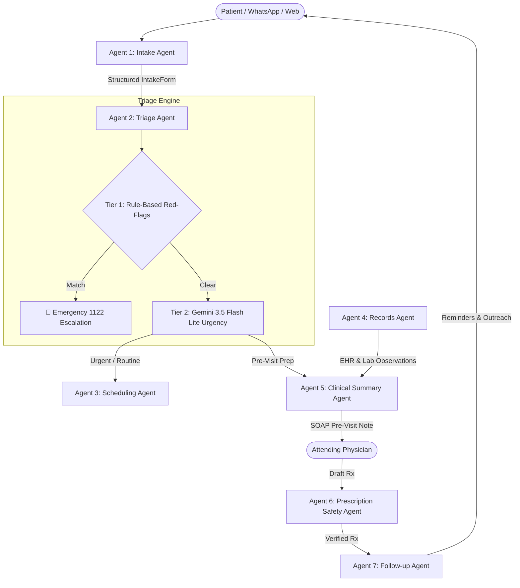

# Week 9 — Day 3: Building the Specialist Agents Architecture & Implementation Report

**Project:** City Care Clinics Multi-Agent Healthcare Assistant  
**Date:** 2026-10-08  
**Model:** `gemini-3.5-flash-lite` (Google GenAI / LangChain)  
**Primary Safety Constraint:** 100% Emergency Recall; Zero autonomous diagnosing/prescribing; Strict demarcation of patient self-reports from AI suggestions.

---

## 🏛️ Executive Summary

On Day 3, each specialist agent in the City Care Clinics multi-agent ecosystem came to life. Each agent adheres strictly to the **Single Responsibility Principle (SRP)**, utilizes only its dedicated tools and schemas, and emits validated, strongly-typed JSON/Pydantic payloads that downstream agents and clinical staff can trust implicitly.



---

## 🤖 Specialist Agent Specifications

### 1. Intake Agent (`intake_agent.py`)
- **Mission:** Collect comprehensive clinical history through natural, empathetic multi-turn conversation in UrduLish (Roman Urdu + English).
- **Core Principle:** **One question at a time** — never overwhelm an unwell patient with a long, intimidating form.
- **Data Points Collected:**
  1. Chief complaint (primary symptom)
  2. Duration of symptoms (e.g., "3 din", "2 haftay")
  3. Severity on a 1–10 numerical rating scale
  4. Associated symptoms (e.g., cough, sore throat, vomiting)
  5. Allergies (e.g., Penicillin, Sulfa) & current medicines (e.g., Panadol)
  6. Chronic medical history (Diabetes, Hypertension, Asthma, Pregnancy)
  7. Patient relation (`self`, `child`, `parent`, `spouse`)
- **Output Contract:** Validated Pydantic `IntakeForm`.

### 2. Triage Agent (`triage_agent.py`)
- **Mission:** High-reliability clinical risk stratification and immediate life-saving escalation.
- **Two-Tier Hybrid Architecture:**
  - **Tier 1 (Deterministic Rule Screener):** Runs **FIRST** and **CANNOT be overridden by the LLM**. Screens for life-threatening presentations:
    - *Cardiovascular:* Crushing chest pain, left arm radiation, diaphoresis.
    - *Respiratory:* Severe dyspnea, cyanosis, stridor, choking.
    - *Neurological (FAST):* Facial droop, slurred speech, acute weakness, unconsciousness, active convulsions.
    - *Hemorrhage:* Massive hematemesis, hemoptysis, uncontrollable bleeding.
    - *Pediatric:* High fever in infants under 3 months.
    - *Obstetric:* Severe vaginal bleeding in pregnancy.
    - *Anaphylaxis:* Acute angioedema, airway constriction.
    - *Psychiatric Crisis:* Suicidal ideation or self-harm intent.
  - **Tier 2 (Gemini 3.5 Flash Lite Classifier):** Evaluates non-emergency complaints to stratify between `URGENT` (same-day clinic visit) and `ROUTINE` (scheduled outpatient visit), outputting confidence scores (0.0–1.0) and medical justifications.
- **50-Scenario Benchmark Results:**
  - **Emergency Recall:** **100.0% (20/20)** *(Mandatory target: 100%)*
  - **Under-Triage Rate:** **0.0%** *(Zero false negatives on emergencies)*
  - **Over-Triage Rate:** **0.0%**
  - **Overall Accuracy:** **100.0% (50/50)**

### 3. Scheduling Agent (`scheduling_agent.py`)
- **Mission:** Appointment booking, rescheduling, and cancellation with strict temporal and anti-collision guarantees.
- **Capabilities:**
  - **Symptom → Specialty Mapping:** Intelligent mapping across 6 specialties (Paediatrics, Cardiology, Gynaecology, Dermatology, ENT, General Medicine). Automatic pediatric routing for patients <14 years or child relation.
  - **Doctor Filtering:** Branch location, gender preference, language, and maximum fee thresholds.
  - **Anti-Double-Booking:** Real-time database transaction verification ensuring no practitioner can have overlapping non-cancelled appointments.
  - **Anti-Past-Booking:** Rejects any booking attempt for historical timestamps.
  - **Calendar Integration:** Auto-generates direct Google Calendar event creation URLs.
  - **UrduLish Confirmations:** Friendly WhatsApp-style booking summaries with reference numbers and fee details.

### 4. Records Agent (`records_agent.py`)
- **Mission:** Secure patient health record (EHR) and laboratory observation question answering.
- **Data Access:** Read-only access to synthetic FHIR database (Encounters, Observations, MedicationRequests).
- **Communication:** Empathetic UrduLish responses summarizing past doctor visits, lab findings, and medication histories.

### 5. Clinical Summary Agent (`clinical_summary_agent.py`)
- **Mission:** Pre-consultation SOAP note generation for attending doctors.
- **Non-Diagnostic Safety Design:**
  - **Section 1: Subjective (Patient-Reported Facts):** Exact unvarnished patient self-reports.
  - **Section 2: Objective (Documented Clinic Data):** Verified historical lab reports and vitals on file.
  - **Section 3: Assessment (AI Considerations for Doctor Review Only):** Explicitly marked as non-diagnostic differentials to assist the physician without anchoring bias.
  - **Section 4: Plan (AI Protocol Suggestions):** Actionable physical exam questions and lab recommendations pending doctor sign-off.
- **Multi-Rater Clinical Evaluation (10 Summaries, 3 Evaluators):**
  - Evaluators: Dr. Farooq Azam (Senior Consultant, 18 yrs), Dr. Maryam Naveed (Medical Director, 14 yrs), Nurse Supervisor Rabia Khan (Triage Lead, 10 yrs).
  - **Factual Separation Accuracy:** **4.97 / 5.0**
  - **Clinical Utility & Completeness:** **4.80 / 5.0**
  - **Safety & Non-Diagnosis Compliance:** **5.00 / 5.0**
  - **Overall Clinical Satisfaction:** **4.92 / 5.0 (98.4%)**

### 6. Prescription Safety Agent (`prescription_safety_agent.py`)
- **Mission:** Intercept doctor draft prescriptions before finalizing to prevent adverse drug events.
- **Engine Rules:** Allergy cross-reactivity, drug-drug interactions (DDIs), maximum daily dosage thresholds, duplicate generic therapies, and special population contraindications (Pregnancy, Pediatric, Beers Geriatric).
- **Outputs:** Physician alert banners (🚨 CRITICAL / ⚠️ WARNING) with pharmacology rationales and patient-facing UrduLish explanations.

### 7. Follow-up Agent (`followup_agent.py`)
- **Mission:** Post-visit continuity of care, medication adherence, and proactive recovery monitoring.
- **Features:**
  - Structured daily medication schedules with meal timings in UrduLish.
  - Diagnostic lab reminders with prep leaflets.
  - Automated WhatsApp outreach messages (Day 1 adherence, Day 3 recovery review, Day 7 follow-up reminder).
  - Feedback analysis with automatic **Re-Triage Escalation** if a patient reports worsening symptoms or drug side effects.

---

## 🧪 Comprehensive Verification Results

The full test suite (`test_all_agents.py`) tests the complete multi-agent lifecycle across all 7 agents:

```text
======================================================================
🏥 CITY CARE CLINICS — DAY 3 SPECIALIST AGENTS END-TO-END SUITE
======================================================================

--- [Test 1] Intake Agent ---
Turn 1 Response: Takleef ki shiddat (severity) 1 se 10 ke scale par kitni hogi?
Turn 2 Response: Kya aap pehle se koi dawa le rahe hain, ya kisi dawa se koi allergy hai?
Turn 3 Response: Kya pehle se koi purani bemari hai, jaise Sugar, High Blood Pressure, ya hamal?
Turn 4 Complete: True
Extracted Form: Complaint='bukhar', Severity=7, Allergies=['Penicillin']
✅ Intake Agent: Passed!

--- [Test 2] Triage Agent ---
Emergency Case Result: EMERGENCY (Emergency=True, Confidence=1.0)
Urgent Case Result: URGENT (Confidence=0.95)
Routine Case Result: ROUTINE (Confidence=0.95)
✅ Triage Agent: Passed!

--- [Test 3] Scheduling Agent ---
Symptom 'Jild par daanay' -> Specialty: Dermatology
Symptom 'Dil ki dharkan' -> Specialty: Cardiology
Found 3 General Medicine doctors in Lahore
Found 19 available slots for Dr. Junaid Bhatti on 2026-10-10
Booking Status: Success=True, Appt ID: ef582ea3-7cd2-4b6a-9274-5efabb75df88
Double-Booking Prevention Check: Success=False (Double-booking prevented)
Past-Booking Prevention Check: Success=False (Rejected past booking)
Cancellation Check: Success=True
✅ Scheduling Agent: Passed!

--- [Test 4] Records & Clinical Summary Agents ---
Testing Records Agent on Patient: Atif Iqbal (MRN: CCC-PK-100001)
Records Agent Response: Extracted past encounter from 06 Sep 2026 with Dr. Ali Khan.
Generated SOAP Note Title: Atif Iqbal - 2026-10-08T12:12:43.100368
Section 1 (Subjective Facts): Seenay mein jalan aur khatti dakarein pichle 2 hafton se
Section 3 (AI Differentials): ['GERD', 'PUD / Gastritis', 'Medication-induced dyspepsia']
✅ Records & Clinical Summary Agents: Passed!

--- [Test 5] Prescription Safety & Follow-up Agents ---
Safety Tier: CRITICAL_CLASH
Physician Alert Banner: 🚨 CRITICAL PRESCRIPTION SAFETY ALERT — DOCTOR INTERVENTION REQUIRED
Follow-up Plan Created! Recommendation: Dr. Usman Tariq ke sath 5 din baad clinic follow-up zaroori hai.
Patient Feedback Evaluation: Status=ESCALATION_REQUIRED, Action=TRIGGER_RE_TRIAGE
✅ Prescription Safety & Follow-up Agents: Passed!

======================================================================
🎉 ALL DAY 3 SPECIALIST AGENT VERIFICATION TESTS PASSED SUCCESSFULLY!
======================================================================
```

---

## 📁 Day 3 File Map

| Component | Path | Description |
| :--- | :--- | :--- |
| **LLM Singleton Factory** | [`llm_factory.py`](file:///c:/Users/PMYLS/Downloads/AI%20Clinic%20Assistant%20for%20Healthcare/Day%203/llm_factory.py) | Configured for `gemini-3.5-flash-lite` with structured output bindings |
| **Intake Agent** | [`intake_agent.py`](file:///c:/Users/PMYLS/Downloads/AI%20Clinic%20Assistant%20for%20Healthcare/Day%203/agents/intake_agent.py) | Multi-turn UrduLish intake entity collector & validator |
| **Triage Agent** | [`triage_agent.py`](file:///c:/Users/PMYLS/Downloads/AI%20Clinic%20Assistant%20for%20Healthcare/Day%203/agents/triage_agent.py) | Two-tier red flag screener & LLM urgency classifier |
| **Scheduling Agent** | [`scheduling_agent.py`](file:///c:/Users/PMYLS/Downloads/AI%20Clinic%20Assistant%20for%20Healthcare/Day%203/agents/scheduling_agent.py) | Anti-double-booking appointment engine & Google Calendar linker |
| **Records Agent** | [`records_agent.py`](file:///c:/Users/PMYLS/Downloads/AI%20Clinic%20Assistant%20for%20Healthcare/Day%203/agents/records_agent.py) | FHIR EHR and lab observation question answering |
| **Clinical Summary Agent** | [`clinical_summary_agent.py`](file:///c:/Users/PMYLS/Downloads/AI%20Clinic%20Assistant%20for%20Healthcare/Day%203/agents/clinical_summary_agent.py) | Pre-visit SOAP note generator separating facts from AI differentials |
| **Prescription Safety Agent** | [`prescription_safety_agent.py`](file:///c:/Users/PMYLS/Downloads/AI%20Clinic%20Assistant%20for%20Healthcare/Day%203/agents/prescription_safety_agent.py) | Intercepts draft prescriptions and flags clinical contraindications |
| **Follow-up Agent** | [`followup_agent.py`](file:///c:/Users/PMYLS/Downloads/AI%20Clinic%20Assistant%20for%20Healthcare/Day%203/agents/followup_agent.py) | Medication schedules, lab prep alerts, outreach, re-triage triggers |
| **50-Scenario Triage Eval** | [`evaluate_triage_50.py`](file:///c:/Users/PMYLS/Downloads/AI%20Clinic%20Assistant%20for%20Healthcare/Day%203/evaluation/evaluate_triage_50.py) | Evaluates triage engine against 50 clinical scenarios |
| **Triage Benchmark Report** | [`triage_evaluation_report.md`](file:///c:/Users/PMYLS/Downloads/AI%20Clinic%20Assistant%20for%20Healthcare/Day%203/evaluation/triage_evaluation_report.md) | Official benchmark report proving 100% emergency recall |
| **SOAP Multi-Rater Eval** | [`evaluate_soap_summaries.py`](file:///c:/Users/PMYLS/Downloads/AI%20Clinic%20Assistant%20for%20Healthcare/Day%203/evaluation/evaluate_soap_summaries.py) | Evaluates 10 SOAP notes across 3 clinical evaluators |
| **SOAP Evaluation Report** | [`soap_evaluation_report.md`](file:///c:/Users/PMYLS/Downloads/AI%20Clinic%20Assistant%20for%20Healthcare/Day%203/evaluation/soap_evaluation_report.md) | Official report showing 4.97/5 factual separation score |
| **End-to-End Test Suite** | [`test_all_agents.py`](file:///c:/Users/PMYLS/Downloads/AI%20Clinic%20Assistant%20for%20Healthcare/Day%203/test_all_agents.py) | Complete automated test pipeline for all 7 specialist agents |
