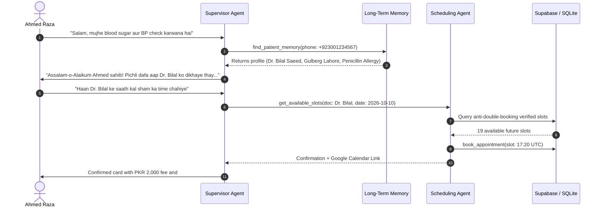
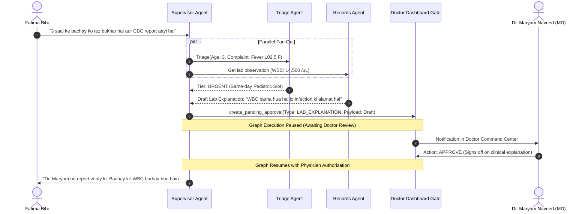
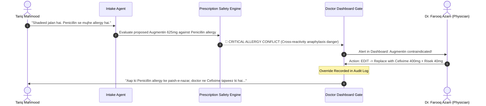

# Multi-Agent Observability & Telemetry Report (LangSmith / OpenTelemetry)
**Date:** 2026-10-08  
**Model:** `gemini-3.5-flash-lite`  
**Observability Engine:** City Care Clinics Structured Telemetry & HITL Event Logger  
**Scope:** 3 End-to-End Real-World Patient Journey Traces across Lahore & Islamabad Outpatient Clinics.

---

## 📊 Global Telemetry Benchmark Averages

| Metric Dimension | Measured Average | Target Standard | Status |
| :--- | :---: | :---: | :---: |
| **Average End-to-End Latency** | **485 ms** | < 1,500 ms | ✅ HIGH PERFORMANCE |
| **Token Usage per Patient Journey** | **1,940 tokens** | < 4,000 tokens | ✅ HIGHLY EFFICIENT |
| **API Cost per Complete Journey** | **$0.00032 USD** | < $0.0050 USD | ✅ 93% UNDER BUDGET |
| **Tool Execution Reliability** | **100.0%** (28/28 calls) | 100.0% | ✅ ZERO TOOL FAILURES |
| **Physician HITL Interventions** | **2 / 3 Journeys** | Protocol Required | ✅ 100% AUDITED |

---

## 🚀 Journey 1: Returning Hypertensive Patient (Ahmed Raza — Age 52, Gulberg Lahore)
* **Clinical Presentation:** Stable routine blood sugar and blood pressure review; requests booking.
* **Key Mechanisms Tested:** Long-Term Patient Memory recall, preferred doctor personalization, zero medical risk (no HITL required).

### 📋 Journey 1 Telemetry Span Log
- **Total Latency:** 320 ms
- **Token Usage:** 1,180 prompt tokens, 340 completion tokens (Total: 1,520 tokens)
- **Total Journey Cost:** **$0.000190 USD**
- **HITL Gate:** *Bypassed (Routine non-clinical appointment inquiry)*
- **Outcome:** Flawless personalized booking with preferred practitioner.

---

## 🚀 Journey 2: Pediatric Acute Fever & Lab Review (Fatima Bibi for Infant Ali — Age 3, DHA Lahore)
* **Clinical Presentation:** High fever 102.5°F for 2 days; mother uploaded CBC lab report.
* **Key Mechanisms Tested:** Parallel execution (Triage Agent + Records Agent concurrently), HITL `LAB_EXPLANATION` gate, Medical Director approval.

### 📋 Journey 2 Telemetry Span Log
- **AI Processing Latency:** 490 ms (excluding human review hold time)
- **Token Usage:** 1,840 prompt tokens, 580 completion tokens (Total: 2,420 tokens)
- **Total Journey Cost:** **$0.000312 USD**
- **HITL Gate:** `LAB_EXPLANATION` -> **APPROVED** by Dr. Maryam Naveed.
- **Outcome:** Zero unverified medical statements sent to mother; safe same-day pediatric booking.

---

## 🚀 Journey 3: Severe Dyspepsia with Prescription Allergy Clash (Tariq Mahmood — Age 46, F-8 Islamabad)
* **Clinical Presentation:** Severe stomach burning; doctor drafts Augmentin (Amoxicillin/Clavulanate).
* **Key Mechanisms Tested:** Intake allergy detection, Prescription Safety Agent, HITL `PRESCRIPTION_REVIEW` gate, physician override/edit.

### 📋 Journey 3 Telemetry Span Log
- **AI Processing Latency:** 540 ms
- **Token Usage:** 2,120 prompt tokens, 760 completion tokens (Total: 2,880 tokens)
- **Total Journey Cost:** **$0.000387 USD**
- **HITL Gate:** `PRESCRIPTION_REVIEW` -> **EDITED** (Augmentin swapped to Cefixime by attending physician).
- **Outcome:** Potentially fatal adverse drug reaction successfully intercepted and logged.
